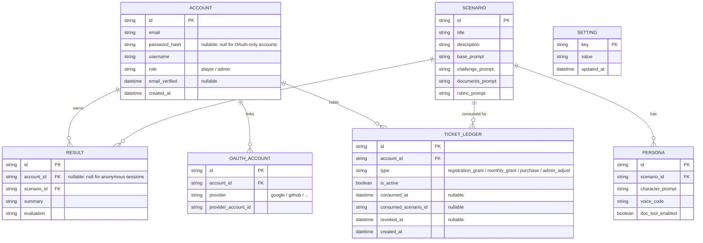

# Data Model

Data has two homes: the **database** (durable and shared, reached through the `Store` provider) and **client session state** (transient, scoped to one playthrough, never persisted). This page covers both.

## Persisted (database)

The diagram shows each table's columns with primary and foreign keys; descriptions follow below.

### Entities

- **ACCOUNT** — A player or administrator, distinguished by `role` (`player` or `admin`). Stores `email`, `username`, `created_at` (registration time), an optional `password_hash` (bcrypt; `null` for accounts that authenticate only via OAuth), and `email_verified`. Its result history is the set of `RESULT` rows that reference it; its linked sign-in providers are its `OAUTH_ACCOUNT` rows; its playable-session credits are the `TICKET_LEDGER` rows that reference it (players only).
- **OAUTH_ACCOUNT** — A link between an `ACCOUNT` and an external OAuth provider (Auth.js calls this an `Account`; named `OAUTH_ACCOUNT` here to avoid colliding with the app's `ACCOUNT`). Holds `provider` and `provider_account_id` (the user's id at that provider). One account may link several providers.
- **SCENARIO** — An authored scenario. Carries player-facing display fields — `title` and `description` (shown on the scenario-selection screen) — plus four prompts: `base_prompt` (the base scenario and world), `challenge_prompt` (the problem the player must solve), `documents_prompt` (how to generate the initial reference material), and `rubric_prompt` (how to score the session). Its cast is the list of `PERSONA` rows that reference it.
- **PERSONA** — One character belonging to a scenario: `character_prompt` (personality and role setup), `voice_code` (the generative-AI voice name), and `doc_tool_enabled` (whether this character may produce work documents).
- **RESULT** — The outcome of a finished session: `summary` (a summary of the interaction) and `evaluation` (the scored feedback). It always references the `SCENARIO` played. `account_id` is `null` for anonymous sessions; otherwise it references the `ACCOUNT` that played.
- **SETTING** — System configuration (AI, voice, …), stored as a `key`/`value` pair with `updated_at` recording the last change.
- **TICKET_LEDGER** — One playable-session credit for a logged-in player. Each row is a single ticket. `type` records how it was issued (`registration_grant`, `monthly_grant`, `purchase`, or `admin_adjust`). `is_active` is `true` while unused; a ticket leaves that state in one of two ways, both logical (rows are never physically deleted): **consumption** sets it to `false`, stamps `consumed_at`, and records `consumed_scenario_id` (the scenario the ticket was spent on); **revocation** (an administrator withdrawing a ticket) sets it to `false` and stamps `revoked_at`. Balance is not stored on `ACCOUNT` — it is derived as the count of active rows for that account.

### Tickets

Only `player` accounts use the ledger. Anonymous sessions and administrators do not consume tickets.

**Grant schedule** (JST calendar days, keyed off the account's `created_at`):

- **Registration** — 3 tickets (`registration_grant`) on first sync after account creation.
- **Recurring** — 1 ticket (`monthly_grant`) every 30 days after registration.
- **Other types** — `purchase` (reserved for paid top-ups) and `admin_adjust` (manual credit by an administrator; a manual debit is expressed by revoking tickets, not by a ledger type).

When deciding how many automatic grants are still owed, only `registration_grant` and `monthly_grant` rows are counted — including consumed and revoked ones, so revoking a granted ticket does not cause the schedule to re-issue it. `purchase` and `admin_adjust` rows affect balance but do not advance that schedule.

Grants are synchronized lazily — when a player account is created, on login, when the ticket balance is read, and immediately before consumption — so overdue periodic grants are issued without a separate cron job.

**Consumption** — Starting a play as a logged-in player consumes the oldest active ticket for that account and records which scenario it was spent on. The ledger is the source of truth; balance is never duplicated in `ACCOUNT` or `SETTING`.

**Revocation** — An administrator can withdraw a player's active tickets. Revocation is logical: the row stays in the ledger with `is_active` set to `false` and `revoked_at` stamped, preserving the audit trail and keeping the grant schedule from re-issuing revoked grants.

> Authentication sessions are **not** persisted: Auth.js uses JWT sessions (a signed, stateless cookie), so there is no session table. (This is distinct from the per-playthrough session state below.)

## Session state (not persisted)

Held in the browser for the duration of one playthrough, lost on reload, and never written to the database:

- **Scenario instance** — the concrete values generated for this play (from the scenario's prompts and personas), including the rolled hidden "truth" (root cause) and each character's hidden facts and current mood.
- **Documents** — the reference material shown, plus any generated during the session.
- **Conversation log** — the running transcript; sent to the server only transiently, to build instructions and to evaluate, and never stored.
- **UI state** — the current screen and other view state.

A finished session is recorded only as a `RESULT` (its summary and evaluation), optionally linked to the playing account. Transcripts and the rolled truth are never persisted.
