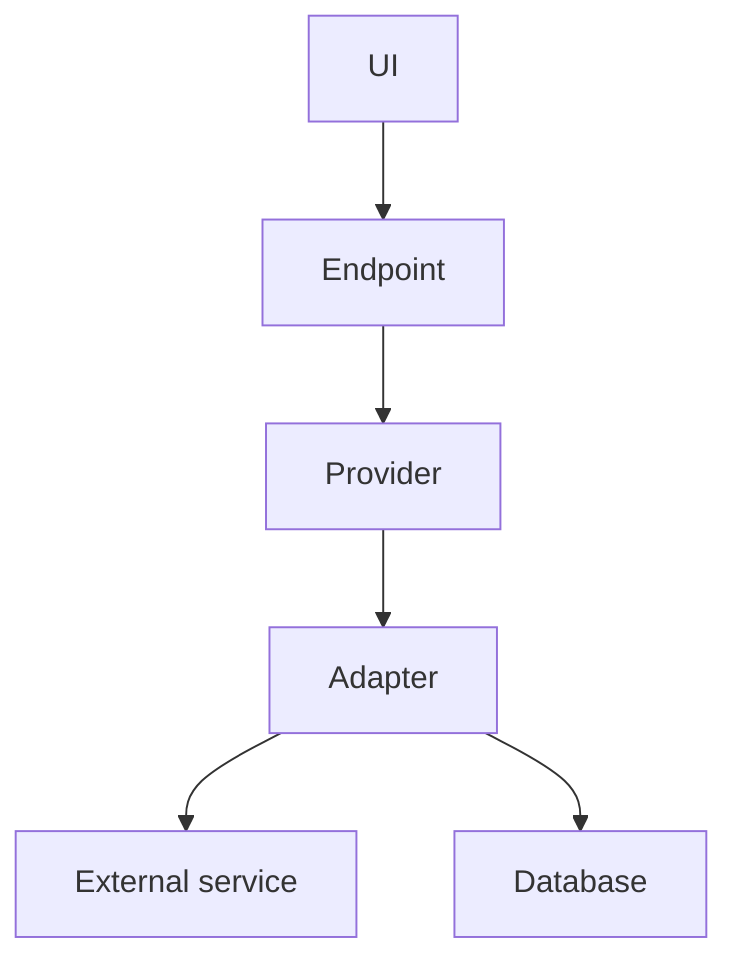

# Architecture Overview

The engine is small and fixed: it drives a roleplay session and reaches every external capability through swappable providers. It does not depend on the deployment environment, the scenario, or any particular provider implementation — it depends only on provider interfaces, behind which concrete adapters can be selected or replaced.

## Components

Each box in the diagram carries a single, stable responsibility. The first three are fixed in code and make up the engine itself; the rest sit at or beyond its boundary.

- **UI** — The player-facing surface. It presents the experience, captures input, and holds the transient state of a session. It carries no domain logic of its own.
- **Endpoint** — The server-side boundary the UI talks to, together with the logic behind it. It orchestrates the flow of an interaction and owns the domain logic. Sensitive material — including a scenario's internal state — stays here and is never exposed to the client.
- **Provider** — An abstraction of a capability the engine needs, expressed as an interface. The engine depends on the provider, never on how that capability is fulfilled.
- **Adapter** — A concrete fulfillment of a provider. It implements the provider's interface and bridges the engine to one external dependency.
- **External service** — A capability the engine consumes but does not own, reached through an adapter and living outside the deployment boundary.
- **Database** — The destination for whatever the engine chooses to persist, likewise reached through an adapter.

### Provider structure

Every provider has the same shape. The engine depends only on the provider (the interface); the adapter behind it reaches the corresponding destination. Adapters can be selected from the built-ins or replaced with new ones without touching the engine, so this shape stays uniform as the set of providers grows. An adapter is not confined to a single component — its implementation may be split across more than one of them.
